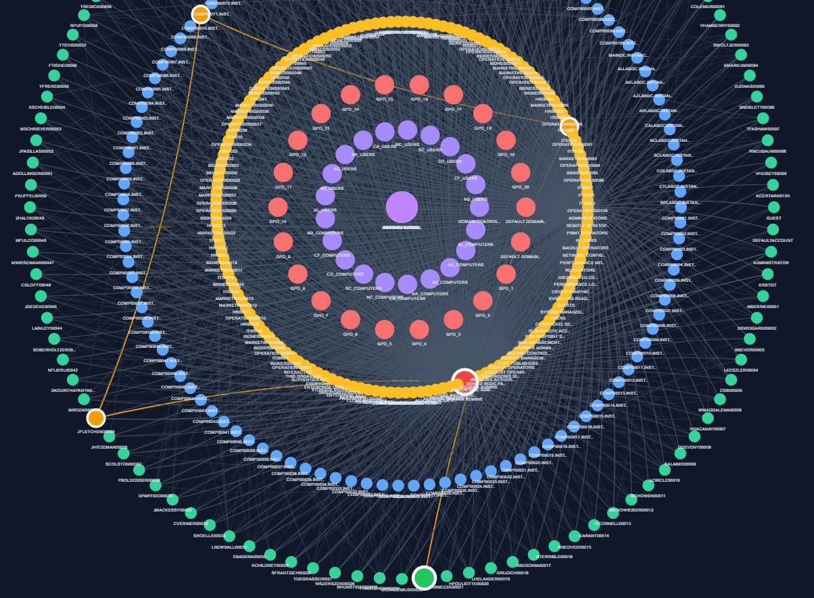
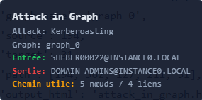

# Kerberos adjusted attack

## What is a Kerberos adjusted Attack?

The **Kerberos Adjusted attack** is a graph-based attack model that simulates **constrained privilege escalation paths** in an Active Directory environment.

It is inspired by Kerberoasting but focuses on **structured path traversal**, not cryptographic attacks.

---

## Definition (Project Scope)

A Kerberos Adjusted path is defined as:

> A path starting from a **User**, passing through at least one **SPN-enabled account**, and ending at an **administrative account**, within a fixed-length traversal.

---

## Key Idea

Kerberos authentication relies on **tickets** to grant access to services.

In this model:
- **SPN accounts** act as pivot points  
- Attackers move through the graph via structured paths  
- The focus is on **reachable escalation chains**, not ticket cracking  

SPN-enabled accounts are critical because they:
- Represent service identities  
- Can be leveraged in privilege escalation scenarios  
- Act as intermediate nodes toward admin access  

---

## Kerberos Adjusted Detection

A valid path must satisfy:

- Start: **User node**  
- End: **Administrative account**
- Path length: **exactly 4 edges (5 nodes)**
- Contains at least one **SPN-enabled node**

---

## Execution Block

```python
kerberos = attacks.run_kerberos_adjusted_attack(
    jsonl_path= graph,
    max_cutoff = 4,
    max_visualize = 5,
    show_plots = True
)
```

This block allows you to:

- Detect Kerberos-constrained attack paths  
- Enforce fixed traversal depth (`max_cutoff`)  
- Visualize selected paths (`max_visualize`)  
- Generate plots (`show_plots`)  

## Output

The function returns:

- Valid Kerberos Adjusted paths  
- SPN pivot nodes involved in escalation  
- Structured attack chains from user to admin  
- Visual representation of constrained paths  

### Example of output

 



## Technical Reference

For more details on the implementation, you can click on this link:

[** attacks creation python module **](https://github.com/Maelh1/Markov_Budget/blob/main/adsimulator_graph_generator/src/attacks.py)

## Security Insight

Kerberos Adjusted paths are important because they:

- Model realistic multi-step attack chains  
- Highlight SPN-based escalation risks  
- Focus on structured and reproducible paths  
- Reveal constrained but effective privilege escalation routes  

## Summary

- **Kerberos Adjusted** = constrained attack path
- Uses SPN accounts as pivot nodes
- Fixed length: 4 edges
- Ends at administrative account