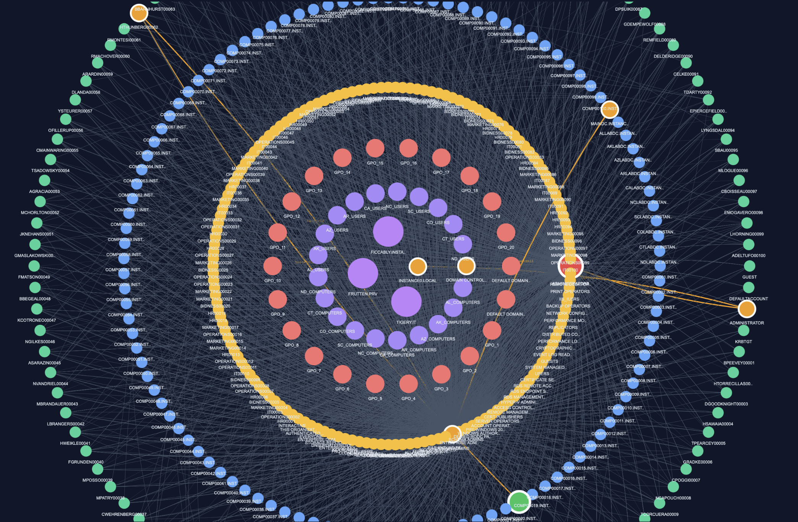
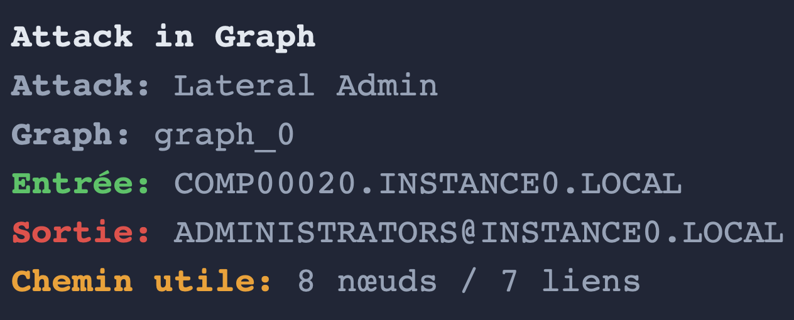

# Lateral Admin Movement

## What is Lateral Admin Movement?

The **Lateral Admin Movement** attack models how an attacker moves across machines and accounts in Active Directory using **lateral access techniques**, eventually reaching a **high-privilege target**.

It focuses on chaining multiple **lateral relations** to simulate realistic post-compromise movement.

---

## Definition (Project Scope)

A Lateral Admin Movement path is defined as:

> A path starting from a **User or Computer**, ending at a **high-value target**, containing at least:
- **2 lateral movement relations**
- **1 Computer node** in the path  

---

## Key Idea

Attackers rarely escalate privileges in a single step.

Instead, they:
- Move laterally between machines  
- Reuse sessions or privileges  
- Pivot across the infrastructure  

Key lateral relations include:
- `AdminTo`
- `HasSession`
- `CanRDP`
- `CanPSRemote`
- `ExecuteDCOM`

These represent real techniques used to move between systems.

---

## Lateral Movement Detection

A valid path must satisfy:

- Start: **User or Computer**  
- End: **Target of interest** (e.g., Administrators)  
- Contains **at least 2 lateral relations**  
- Includes **at least one Computer node**  

---

## Execution Block

```python
cases = attacks.run_lateral_admin_movement(
    jsonl_path=graph,  
    max_cutoff=7,
    export_files=True,
    top_k_print=5,
    top_k_export=20
)
```

This block allows you to:

- Detect lateral movement attack chains  
- Limit path length (`max_cutoff`)  
- Export results (`export_files`)  
- Display top cases (`top_k_print`)  
- Export a larger dataset (`top_k_export`)  

## Output

The function returns:

- Multiple lateral movement paths  
- Chains combining sessions, admin rights, and remote access  
- Structured paths leading to privileged targets  

### Example of output

 



## Technical Reference

For more details on the implementation, you can click on this link:

[** attacks creation python module **](https://github.com/Maelh1/Markov_Budget/blob/main/adsimulator_graph_generator/src/attacks.py)

## Security Insight

Lateral movement is critical because it:

- Reflects real attacker behavior post-compromise  
- Exploits existing sessions and permissions  
- Enables gradual escalation toward admin access  
- Reveals hidden attack chains across machines  

## Summary

- **Lateral Admin Movement** = multi-step lateral traversal
- Uses sessions, remote access, and admin rights
- Requires multiple lateral relations
- Includes computer pivots
- Leads to high-privilege targets