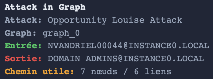

# Opportunity Attack

## What is an Opportunity Attack?

The **Opportunity Attack** is a graph-based attack model based on a **random walk strategy** in an Active Directory environment.

It simulates an attacker moving **without a predefined strategy**, stopping only when reaching **predefined high-value targets**.

---

## Definition (Project Scope)

An Opportunity Attack is defined as:

> A random traversal in the graph starting from any node, progressing step by step, and stopping when a **target of interest** is reached.

---

## Key Idea

Unlike structured attacks, this model does **not follow optimal paths**.

Instead:
- The attacker explores the graph **randomly**
- No prior knowledge of the environment is required  
- Success depends on **opportunistic discovery of targets**  

Targets typically include:
- Privileged groups (e.g., Domain Admins)  
- Sensitive accounts  
- High-impact nodes  

---

## Opportunity Attack Detection

A valid attack path is:

- A **random walk** starting from any node  
- A sequence of valid graph transitions  
- Ending when a **target node** is reached  

There are no strict constraints on:
- Path length  
- Relation types  
- Structure  

---

## Execution Block

```python
louise = attacks.run_louise_attack(
    jsonl_path= graph,
    min_success = 150,
    min_nodes_for_long = 12,
    max_attempts = 10000000,
    max_steps = 100,
    show_paths = True,
    show_long_paths= True
)
```
This block allows you to:

- Launch large-scale random explorations of the graph  
- Control the number of successful paths (`min_success`)  
- Define long path thresholds (`min_nodes_for_long`)  
- Limit exploration (`max_attempts`, `max_steps`)  
- Display discovered paths (`show_paths`, `show_long_paths`)  

## Output

The function returns:

- Multiple successful attack paths  
- Short and long opportunistic paths  
- Source → target chains discovered randomly  

### Example of output

 



## Technical Reference

For more details on the implementation, you can click on this link:

[** attacks creation python module **](https://github.com/Maelh1/Markov_Budget/blob/main/adsimulator_graph_generator/src/attacks.py)

## Security Insight

Opportunity attacks highlight that:

- Attackers do not always follow optimal strategies  
- Random exploration can still lead to critical compromise  
- Large graphs increase the probability of unexpected paths  
- Hidden attack chains may exist without obvious structure  

## Summary

- **Opportunity Attack** = random graph traversal  
- No predefined strategy  
- Stops on high-value targets  
- Reveals unexpected attack paths  
- Simulates realistic attacker exploration behavior  