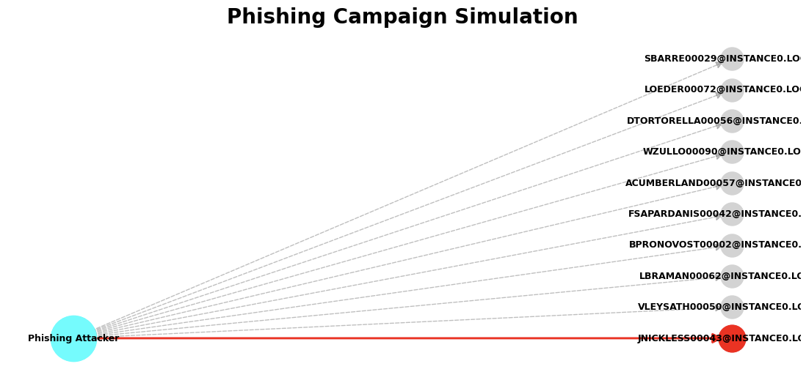

# Phishing Attack

## What is a Phishing Attack?

The **Phishing Attack** simulates an initial intrusion where an external attacker targets users through a **malicious email campaign**.

The goal is to obtain **valid credentials** and gain a first foothold in the system.

---

## Definition (Project Scope)

A Phishing Attack is defined as:

> A probabilistic selection of users receiving phishing emails, where some accounts become **compromised based on a success probability**.

---

## Key Idea

An attacker sends a targeted phishing campaign:
- Around **10 users are selected**  
- Emails mimic legitimate internal communication  
- Some users ignore the attack  
- Others **click and submit credentials**  

This results in:
- A set of **compromised user accounts**
- Initial entry points into the graph  

---

## Phishing Simulation

The simulation performs:

- Random selection of users  
- Application of a **success probability (0% → 10%)**  
- Identification of compromised accounts  

---

## Execution Block

```python
phishing = attacks.run_phishing_campaign(
    jsonl_path = graph,
    target_count = 10,
    prob_range = (0.0, 0.1),
    user_label = 'User',
    name_property = 'name',
    seed = None,
    show_plot = True,
)
```
This block allows you to:

- Select targeted users (`target_count`)  
- Control success probability (`prob_range`)  
- Define user node type (`user_label`)  
- Ensure reproducibility (`seed`)  
- Visualize compromised accounts (`show_plot`)  

## Output

The function returns:

- Targeted users  
- Successfully compromised accounts  
- Initial access points in the graph  
- Visualization of the intrusion phase 

### Example of an output :


## Technical Reference

For more details on the implementation, you can click on this link:

[** attacks creation python module **](https://github.com/Maelh1/Markov_Budget/blob/main/adsimulator_graph_generator/src/attacks.py)

## Security Insight

Phishing attacks are critical because they:

- Represent a realistic initial attack vector  
- Exploit human behavior rather than technical flaws  
- Provide entry points for further attacks  
- Enable chaining with other attack models  

## Summary

- **Phishing** = initial access simulation  
- Targets multiple users  
- Uses probabilistic success  
- Produces compromised accounts  
- Acts as entry point for further attacks