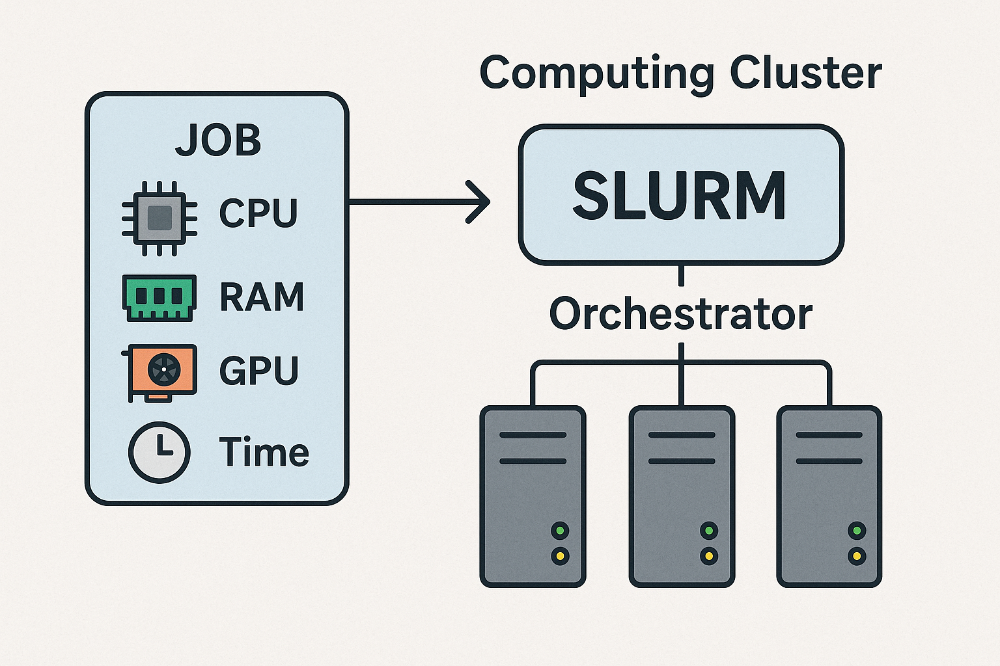

# Slurm cluster

---
## What is Slurm?

SLURM (Simple Linux Utility for Resource Management) is an open-source, fault-tolerant, and highly scalable job orchestrator for high-performance computing (HPC) clusters of any size. It manages cluster resources, schedules jobs, and distributes computational workloads efficiently across multiple servers. It handles job queues, resource sharing between teams, priorities, and more.

As a user, you don't need to know which server will run your job. **Just specify the resources you need (CPU cores, RAM, GPU type/number, etc.)**, and Slurm will launch your job on the most suitable available resources. If no resources are available, your job is queued with priority management.

{width="66%"}

**Slurm provides three core functions:**

- Allocates exclusive and/or shared access to compute nodes for a specified duration
- Provides a framework for starting, executing, and monitoring jobs on allocated nodes
- Manages contention for resources by maintaining a queue of pending jobs

**With Slurm, you can:**

- Launch programs or shells interactively (e.g., Python shell, Jupyter Notebook)
- Reserve resources to run multiple programs in the same environment
- Submit jobs in batch mode: jobs are queued and executed automatically when resources become available

More informations : 

- **SLURM Homepage** : [https://slurm.schedmd.com/](https://slurm.schedmd.com/){target="_blank"}.

- **SLURM in Wikipedia**: [https://fr.wikipedia.org/wiki/SLURM](https://fr.wikipedia.org/wiki/SLURM){target="_blank"}.

---
## Resource management 

### Partitions

A **partition** in Slurm is a logical grouping of compute nodes, often representing a queue with specific characteristics or access policies. Partitions help organize servers based on hardware features (such as GPU availability, memory size), intended usage (production, testing, teaching), or user groups.

When you submit a job, you can specify the partition to target resources that best fit your needs. If no partition is specified, jobs are typically assigned to the cluster's default partition.

Partitions enable administrators to:

- Control access to resources for different teams or projects
- Prioritize workloads based on organizational policies
- Separate environments for production, development, or teaching

### Ressource sharing and access priority

Let's consider a GPU server assigned to a particular team:

- The server is included in both the **team's dedicated** partition and a **global** partition.
- Team members can submit jobs to the team's partition for priority access to the GPU server.
- Other users can submit jobs to the global partition, utilizing the server when it is idle.
- If a team member submits a job while the server is running a global partition job, Slurm can preempt or stop the lower-priority job to free resources for the team.

This configuration ensures that teams have fast access to their resources while maximizing overall cluster usage by allowing others to use idle servers.

---
## Advantages and Limitations

### SSH Access

- Compute nodes are not directly accessible via SSH.
- To SSH a compute node, you must first reserve resources with SLURM.
- SSH session end automatically when the resource allocation expires.
- This prevents direct, concurrent use of compute resources outside of Slurm job management.

### Job execution environment
- Jobs are assigned to the most suitable compute node, based on your requirements.
- You may need to experiment with Slurm options (e.g., salloc) to optimize your job's environment.

### Running jobs in background

- Jobs can be submitted to run in the background and placed in a queue. No need to stay connected.
- Output data are not displayed directly on the terminal and should be written to a result file. 

---
## Launching a job in interactive mode

Old method:

- Find an available server to launch the job:
    - Ask colleagues which jobs are running,
    - Once a server is identified, check available resources (via SSH or other)
- Connect via SSH to the server and launch your job manually

With Slurm:

- Connect via SSH to a Slurm login node
- Use the `srun` command to :
    - Request resources from Slurm specifying your job's needs
    - Submit your job.
  
If you need to launch multiple jobs or require an SSH session on a compute node, use the resource allocation command `salloc` to reserve resources. After allocation, you can:

- Use the `srun` command to run your jobs interactively within the reserved environment.
- Or, connect via SSH to the assigned compute node and manually launch your job.

This approach ensures your jobs run on dedicated resources managed by Slurm.

---
## Launching a job in batch non-interactive mode

- Write a configuration file ("SBATCH" script) describing your job: name, environment, required resources, etc.
- Connect via SSH to a Slurm login node.
- Submit your job in batch mode; Slurm queues and runs it when resources are available.

---
## Data Storage

On IMT Atlantique "Campus" machines (servers and TP rooms), your IMT Atlantique home directory (`/homes/login/`), is automatically mounted during graphical or SSH session.

On Slurm compute nodes :

- Your IMT Atlantique home directory is mounted in interactive sessions.
- In non-interractive batch session, no graphical or SSH session is opened, **your IMT Atlantique home directory is not mounted and is therefore inaccessible for jobs.**

**You must use MINOS shared volumes for your jobs.**

Each team with storage needs has a dedicated MINOS volume (e.g., /Brain, /Odyssey). These are available on all servers. You can transfer data from your personal IMT Atlantique account to these shared spaces via the Slurm login nodes.

For details, see: [Minos Dedicated server storage](storage.md)

Your IMT Atlantique accounts are not accessible in HPC centers, so it's a good practice to get used to work without them.

- For code : use version control tools like IMT Atlantique Gitlab *([https://gitlab.imt-atlantique.fr/](https://gitlab.imt-atlantique.fr/))*, or external services like Github *([https://github.com/](https://github.com/))*, Gitlab *([https://about.gitlab.com/](https://about.gitlab.com/))*, etc.
- For data: you can use IMT "partage" storage space *([https://partage.imt.fr/](https://partage.imt.fr/))*, or any other external storage. But for performance and internet usage reasons, prefer the dedicated MINOS volumes.

---
## Global Architecture

General schema of the cluster:

To use the Slurm MEE cluster, you must go through one of the login nodes `sl-mee-br-101.imta.fr` or `sl-mee-br-116.imta.fr`.

