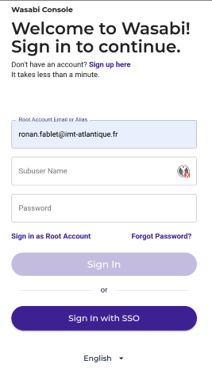

# Wasabi (ODYSSEY team)

- Wasabi is an Object Storage platform, compatible with Amazon S3.

- Data can be public or private (However, we only publish public data)

- Data stored in Wasabi can be downloaded without an account. An account is required to upload content or access private data.

---
## Object Storage Basics

### Overview

Object storage is a model where files are stored as objects, without a hierarchical structure (folders).

Each object has a unique identifier.

Metadata is associated with each object, enabling searches based on specific criteria.

Object storage allows scalable and secure file storage and retrieval. It is widely used in cloud environments.

**S3 (Simple Storage Service)** is the storage service offered by Amazon Web Service (AWS) and has become a de facto standard.

### Buckets and Objects

- A **bucket** is a container that groups stored files. Each bucket has a **unique name** and can be configured with management rules, such as versioning or access control.  
- An **object** represents a file stored in a bucket. It is identified by a **unique key** (virtual access path) and accompanied by metadata (MIME type, permissions, etc.).  

### Accessing Files via HTTP

- S3 objects are accessible via **HTTP URLs** following the structure: `https://<endpoint>/<bucket>/<object>`
- Access can be **public** (if configured) or **private**, requiring authentication with **API keys** or **pre-signed URLs**.  
- The S3 REST API allows operations such as **PUT (upload), GET (read), or DELETE (delete)** using tools like `curl`, `aws-cli`, or SDKs.

### Security and Permissions

- Access permissions are defined through **IAM policies**, **ACLs**, or **bucket rules**.
- Encryption can be enabled to secure stored objects.  

---
## Direct Access to Data

Data uploaded to Wasabi can be downloaded via a simple HTTPS request:

- Using a browser
- Using a command-line tool like AWS CLI or curl
- Directly within your code.

Example of downloading a file:

- with wget
``` bash
wget -q --show-progress \
    'https://s3.eu-west-2.wasabisys.com/4dvarnet/german-wadden-sea/Obs_SPM_log10_aNam.nc' \
    -O 'data/Obs_SPM_log10_aNam.nc'
```
- with curl
``` bash
curl --progress-bar \
     'https://s3.eu-west-2.wasabisys.com/4dvarnet/german-wadden-sea/Obs_SPM_log10_aNam.nc' \
     -o 'data/Obs_SPM_log10_aNam.nc'
```

In the case of private data, authentication information must be used:

- Either by using the API access TOKEN and the AWS client.
- Or by using a pre-authenticated URL provided by the data owners: valid for a limited time and usable with curl or wget.

---
## Obtaining a Wasabi Account

User accounts are created individually by one of the administrators.

The administrators are:

- Ronan Fablet: `ronan.fablet@imt-atlantique.fr`
- Daniel Zhu: `daniel.zhu@imt-atlantique.fr`
- Emmanuel Braux: `emmanuel.braux@imt-atlantique.fr`

Account creation requests should preferably be sent to Emmanuel Braux via Slack.

---
## Accessing the Wasabi Console

Access to the Wasabi graphical interface (console) is done as a Sub-user: [https://console.wasabisys.com/subuserLogin](https://console.wasabisys.com/subuserLogin)

- Email or root account address: `ronan.fablet@imt-atlantique.fr`
- Sub-user account name: **your username** (not your email)
- Password: **your password**




## Generate Access Keys

Access keys are required for downloading private data or using the AWS client.

To obtain your **Access Key** and **Secret Key** in Wasabi:

- Log in to the Wasabi interface.
- From the left menu, select **"Access Keys"**.
- Create a new pair of access keys:
    - Click the **"Create New Access Key"** button.  
    - Choose the **sub-user** option, and select your login from the list.
    - A new **Access Key / Secret Key** pair will be generated.
- Copy and save the keys:
    - The **Access Key** and **Secret Key** will be displayed.  
    - Download the CSV file to save them, as the **Secret Key will no longer be visible after this step**.

---
## Generate a Pre-Signed URL

Wasabi allows you to create pre-signed URLs to temporarily enable the download of private files:

- The URL **automatically expires** after the specified duration.
- **Only those with the URL** can download the file.

To generate a pre-signed URL:

- Log in to the Wasabi interface.
- From the left menu, select **"Buckets"**.
- Select the bucket containing your file and navigate to the file you want to share.
- Click on the three dots **(⋮)** to the right of the file.
- Select **"Generate Pre-Signed URL"**.
- Choose the **validity duration** for the URL (e.g., 1 hour, 1 day, etc.).
- Click **"Generate"**.
- A URL will be generated, resembling this: `https://s3.wasabisys.com/my-bucket/file.txt?AWSAccessKeyId=XXXX&Signature=YYYY&Expires=ZZZZ`.
- Copy this URL and use it with `curl`, `wget`, or in your browser.

If you wish to revoke it before expiration, **delete the file or change its permissions**.

---
## Using the AWS CLI

If needed, install the AWS S3 client (see annexes). No administrative rights are required.

You also need to generate access tokens in Wasabi: `<ACCESS_KEY>` and `<SECRET_KEY>`.

The configuration details for setting up the AWS client are:

- AWS Access Key ID: (Your Wasabi Access Key)  
- AWS Secret Access Key: (Your Wasabi Secret Key)
- Default region name: `us-east-1` (although Wasabi does not depend on AWS regions)
- Default output format: json (or table or text, depending on your preferences)

Run the configuration command and provide the required information (only needed the first time):
```bash
aws configure --profile wasabi
```

Test the connection by listing the buckets:
```bash
aws s3 ls --profile wasabi --endpoint-url=$WASABI_ENDPOINT
```
export WASABI_ENDPOINT='https://s3.eu-central-1.wasabisys.com'
aws s3 ls --profile wasabi --endpoint-url=$WASABI_ENDPOINT
```
To download or upload files:
``` bash
aws s3 cp <chemin_local> s3://<bucket>/<chemin_distant> --recursive --endpoint-url=$WASABI_ENDPOINT
``` 
For more information:

- AWS CLI website: [https://aws.amazon.com/cli/](https://aws.amazon.com/cli/)
- Using the AWS client with WASABI: [https://docs.wasabi.com/v1/docs/how-do-i-use-aws-cli-with-wasabi](https://docs.wasabi.com/v1/docs/how-do-i-use-aws-cli-with-wasabi)
- WASABI / AWS S3 compatibility : [https://docs.wasabi.com/docs/since-wasabi-is-100-bit-compatible-with-amazon-s3-can-i-use-my-existing-s3-compatible-application-without-making-any-changes-to-my-application-with-wasabi](https://docs.wasabi.com/docs/since-wasabi-is-100-bit-compatible-with-amazon-s3-can-i-use-my-existing-s3-compatible-application-without-making-any-changes-to-my-application-with-wasabi)

---
## Bucket Management

- Log in to the Wasabi interface.
- From the left menu, select **"Bucket"**.

The Wasabi interface allows you to manage buckets and upload files.

For more information on managing files within a bucket: [https://docs.wasabi.com/docs/working-with-folders-and-files](https://docs.wasabi.com/docs/working-with-folders-and-files)


---
## Additional resources and tutorials on using Wasabi : 

- [https://docs.wasabi.com/v1/docs/tutorials-1](https://docs.wasabi.com/v1/docs/tutorials-1)


---
## Annexes

### Local Installation of AWS S3 Client Without Admin Rights

- Download the portable AWS CLI. AWS provides a standalone version of the CLI client that does not require system installation.
```bash
cd /tmp
curl "https://awscli.amazonaws.com/awscli-exe-linux-x86_64.zip" -o "awscliv2.zip"
```
- Extract the archive
```bash
unzip awscliv2.zip
```
- Install AWS CLI in your working directory
```bash
export WORKING_DIR='xxxxxxxxxxx'
mkdir -p $WORKING_DIR/aws-cli
./aws/install --install-dir $WORKING_DIR/aws-cli --bin-dir $WORKING_DIR/aws-cli/bin
```
- Verify the installation
```bash
$WORKING_DIR/aws-cli/bin/aws --version
# aws-cli/2.25.4 Python/3.12.9 Linux/6.8.0-52-generic exe/x86_64.ubuntu.22
```
- [Optional] Simplify command usage in the current session
```bash
alias aws="$WORKING_DIR/aws-cli/bin/aws"
```
- [Optional] Simplify permanent access to the command: add the directory containing `aws-cli` to your PATH variable by modifying `~/.bashrc` or `~/.bash_profile`:
```bash
echo 'export PATH=$WORKING_DIR/aws-cli/bin:$PATH' >> ~/.bashrc
source ~/.bashrc
```

Source: [https://docs.aws.amazon.com/cli/latest/userguide/getting-started-install.html](https://docs.aws.amazon.com/cli/latest/userguide/getting-started-install.html)

### Installing AWS S3 Client with pip

Install AWS CLI with pip in your `$HOME`:

```bash
pip install --user awscli
```
And add `~/.local/bin` to your `PATH`:
```bash
echo 'export PATH=$HOME/.local/bin:$PATH' >> ~/.bashrc
source ~/.bashrc
```
