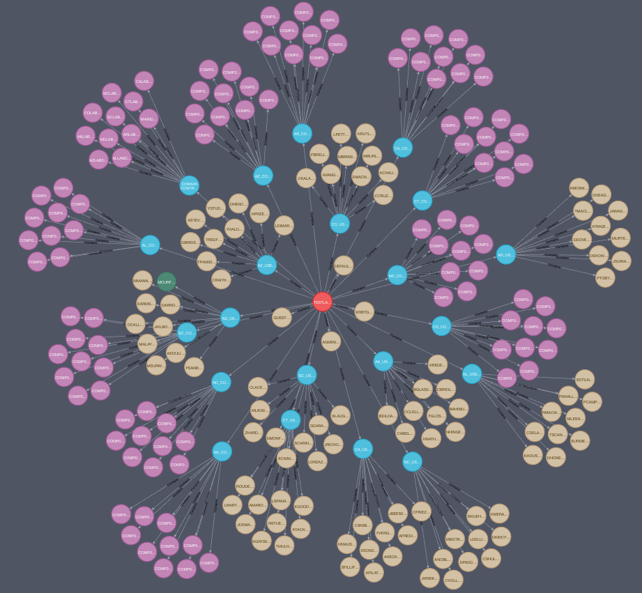

# ADSimulator – Explanation
## 1. What is ADSimulator ?

**ADSimulator is a tool that generates synthetic Active Directory environments as graphs.**

- It creates a realistic but fake Active Directory
- It stores the data in Neo4j
- It simulates:
  - Users
  - Groups
  - Computers
  - Permissions
  - Vulnerabilities

# ADSimulator - Explanation

## 1. What ADSimulator Is

**ADSimulator is a tool that generates synthetic Active Directory environments as graphs.**

It creates a **realistic but artificial Active Directory**, designed for experimentation and analysis.

It:
- Generates users, groups, computers, and permissions  
- Injects vulnerabilities into the environment  
- Stores the resulting graph in Neo4j

The goal is to reproduce a realistic AD environment to simulate attacks and support cybersecurity research.

---

## 2. Core Concept: Graph-Based Modeling

ADSimulator represents Active Directory as a graph structure, where:

### Nodes represent:
- Domains  
- Organizational Units (OU)  
- Users  
- Groups  
- Computers  
- GPOs  

### Relationships represent:
- `MemberOf` → group membership  
- `AdminTo` → local admin rights  
- `HasSession` → active session  
- `TrustedBy` → trust relationships  
- `Contains` → AD hierarchy  
- `ACLs` → critical permissions (`GenericAll`, `WriteDacl`, etc.)

This structure is aligned with BloodHound’s data model, making it intuitive for attack path analysis.

---

## 3. Key Features

### a) Configurable Environment Generation

ADSimulator allows full control over the generated environment:

- Number of users, groups, and computers  
- AD structure (OUs, GPOs, trust relationships)  
- Operating systems  
- Security policies  

Example:
- `nUsers = 1000`  
- `nComputers = 500`  
- `nOUs = 200`

---

### b) Vulnerability Injection

You can deliberately introduce security weaknesses to simulate real-world misconfigurations:

- Misconfigured ACLs (`GenericAll`, `WriteDacl`)  
- Kerberos weaknesses (e.g., no pre-authentication)  
- Weak or missing passwords  
- Unsafe delegation settings  

This allows you to generate a secure environment or a highly vulnerable one.

---

### c) Probabilistic Modeling

Many properties are defined using **probabilities**, enabling realistic distributions.

Examples:
- 20% of users have an SPN → Kerberoasting possible  
- 10% have `passwordnotreqd`  
- 5% have unconstrained delegation  

This enables:
- More realistic simulations  
- Statistical analysis of attack paths  

---

## 4. Workflow

Typical usage:

1. Define a configuration file (JSON)  
2. Run ADSimulator  
3. The tool:
   - Generates the graph  
   - Loads it into Neo4j  
4. Analyze the environment using:
   - Cypher queries  
   - Graph-based tools (e.g., BloodHound-style analysis)

---

## 5. Main Use Cases

### A. Cybersecurity Research
- Study attack paths  
- Evaluate privilege escalation strategies  

### B. Attack Simulation
- Kerberoasting  
- DCSync  
- ACL abuse  

### C. Defense Optimization
- Identify critical nodes  
- Test mitigation strategies  

---

## 6. Relevance for Graph-Based Security Models

ADSimulator is particularly useful for:

- Building realistic graph datasets  
- Testing attack path algorithms
- Applying probabilistic models (e.g., Markov chains)

It provides:
- Structured graph data  
- Realistic vulnerability distributions  
- A controlled experimental environment  

---

## 7. Summary

**ADSimulator is a graph-based Active Directory generator with probabilistic vulnerabilities, designed to simulate and analyze cyberattacks.**

It:
- Generates realistic AD environments  
- Models permissions and relationships as a graph  
- Injects vulnerabilities using probabilities  
- Enables attack simulation and security analysis  
