# Concrete examples to better understand cyberattacks

Welcome to this section dedicated to the practical understanding of cyberattacks. To effectively secure an infrastructure, it is crucial to understand the methodology used by attackers.

These two stories show that a hacker doesn't always need to be a "genius" using complex tools. Often, they simply take advantage of small oversight or "open doors" that we leave behind without noticing.

---

## Example 1 : the history that betrays everything
**Theme: Secret extraction and lateral movement via shell history.**

This first example demonstrates that a successful intrusion does not always require the exploitation of complex software vulnerabilities (CVEs). A simple configuration error in the read permissions of a hidden file is enough to grant an attacker full control over the infrastructure.

---

## Example 2 : The network map handed over in plain sight
**Theme: Passive reconnaissance and service account exploitation.**

This second scenario shows how a user with very limited privileges (an intern) can map an entire infrastructure by consulting standard system files, leading to the compromise of critical backups.

---

## Conclusion

These two case studies highlight a crucial point in modern cybersecurity: 
**The attacker didn't need to force entry, they simply exploited existing, overlooked access points.**

* **No suspicious activity:** The attacker didn't have to "test" every door; they knew exactly where to go.

* **No high-tech hacking:** They didn't use a virus or a complex bug; they just used the system as it was.

* **No alarms triggered:** Since they had the right keys, the security system thought they were a normal employee.

Securing an **Active Directory** or a Linux infrastructure starts with hardening local configurations and strictly applying the Principle of Least Privilege.

