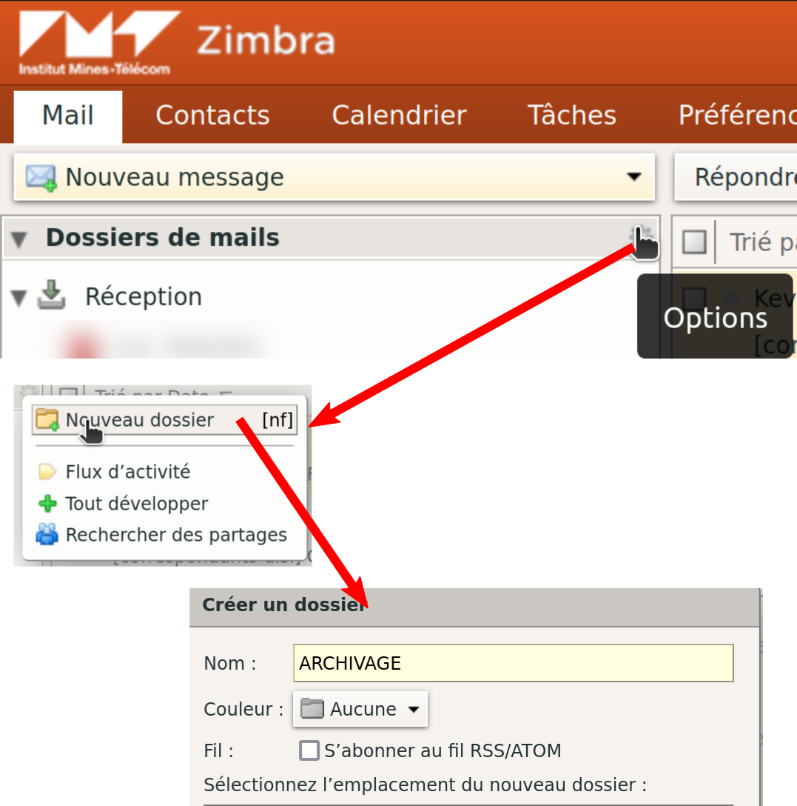

# Messagerie Zimbra

Zimbra est l'outil adopter par l'IMT pour gérer la messagerie mail. L'application webmail est disponible ici : [https://z.imt.fr](https://z.imt.fr).

## Archivage Mails Zimbra

Il est possible de sauvegarder un ensemble de mails sous forme d'une archive zip depuis zimbra.

### Création du répertoire ARCHIVAGE
Il faut créer un répertoire nommé `ARCHIVAGE` (en majuscules) à la racine dans zimbra (au même niveau que Réception, pas à l'intérieur) :



- **Recherche des emails à archiver**

On peut glisser/déposer les emails un à un manuellement, mais si le but est de faire de la place sur son quota Zimbra, le plus efficace est la recherche par date pour archiver les plus anciens.

Le champs de recherche Zimbra permet de faire facilement des recherches par date et plages de date. Par exemple, pour rechercher tous les mails de l'année 2018 :
```
after:31/12/2017 AND before:01/01/2019
```
!!! info
    Les bornes de la plage de dates ne sont pas inclusive.

- **Sélection complète des emails et déplacement dans ARCHIVAGE**

Le résultat de recherche n'affiche pas plus de 400 résultats pour ne pas impacter le temps de chargement. Pour sélectionner l'intégralité de la recherche, il faut utiliser le raccourci clavier ++ctrl+shift+a++

Ensuite il faut glisser déposer dans le dossier ARCHIVAGE.

- **Téléchargement de l'archive**

Il faut cliquer sur le lien [https://z.imt.fr/zimbra/home/~/ARCHIVAGE?fmt=zip](https://z.imt.fr/zimbra/home/~/ARCHIVAGE?fmt=zip) pour que l'archive zip soit créée et disponible au téléchargement. En fonction du nombre d'emails à archiver, la création peut prendre un certain temps.

Une fois l'archive téléchargée, vous pouvez supprimer le contenu du répertoire ARCHIVAGE sur Zimbra.

Source :

- Intranet DISI : [https://intranet.imt-atlantique.fr/assistance-support/informatique/didacticiels/archiver-un-ou-plusieurs-mails-pour-liberer-de-lespace-sur-votre-messagerie/](https://intranet.imt-atlantique.fr/assistance-support/informatique/didacticiels/archiver-un-ou-plusieurs-mails-pour-liberer-de-lespace-sur-votre-messagerie/)

- Recherche Zimbra :
[https://zimbra.github.io/zwcguide/latest/index.html#_search_filters_you_can_use](https://zimbra.github.io/zwcguide/latest/index.html#_search_filters_you_can_use)

## Configuration client lourd (thunderbird, zimbra, K9 mail etc)

Source : [https://webmail.telecom-bretagne.eu/configuration/](https://webmail.telecom-bretagne.eu/configuration/)

### Pour la réception

- protocole IMAPS
- port TCP : 993
- serveur à contacter : z.imt.fr
- authentification demandée : Votre adresse et votre mot de passe habituel

### Pour l'envoi

Soit :

- protocole SMTPS
- port TCP : 465
- serveur à contacter : z.imt.fr
- authentification demandée : Votre adresse et votre mot de passe habituel

Soit :

- protocole SMTP STARTTLS
- port TCP : 587
- serveur à contacter : z.imt.fr
- authentification demandée : Votre adresse et votre mot de passe habituel
