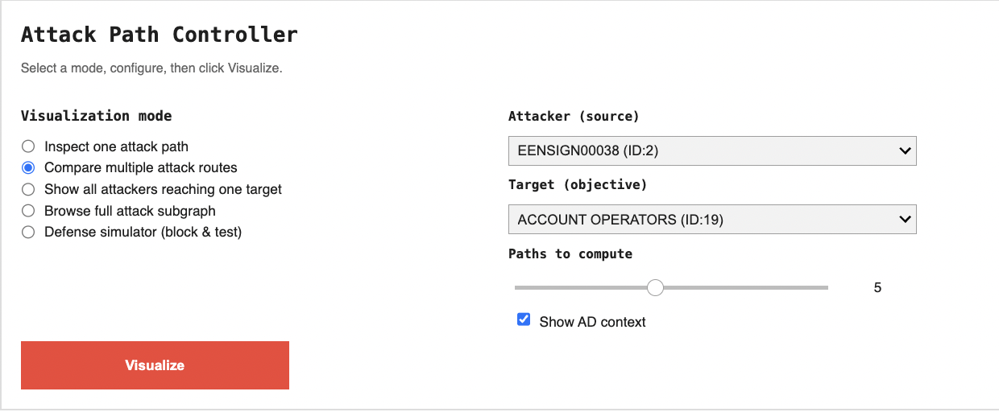
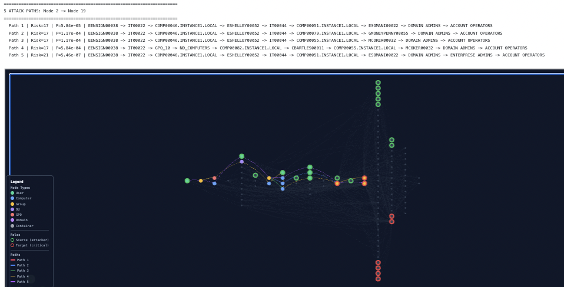
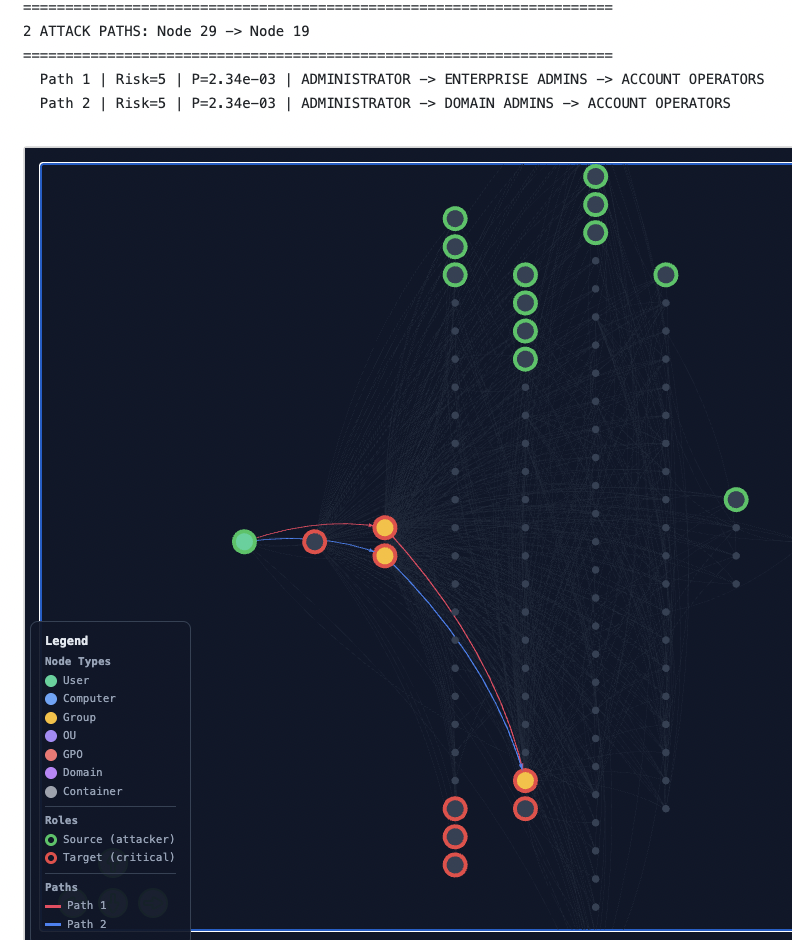
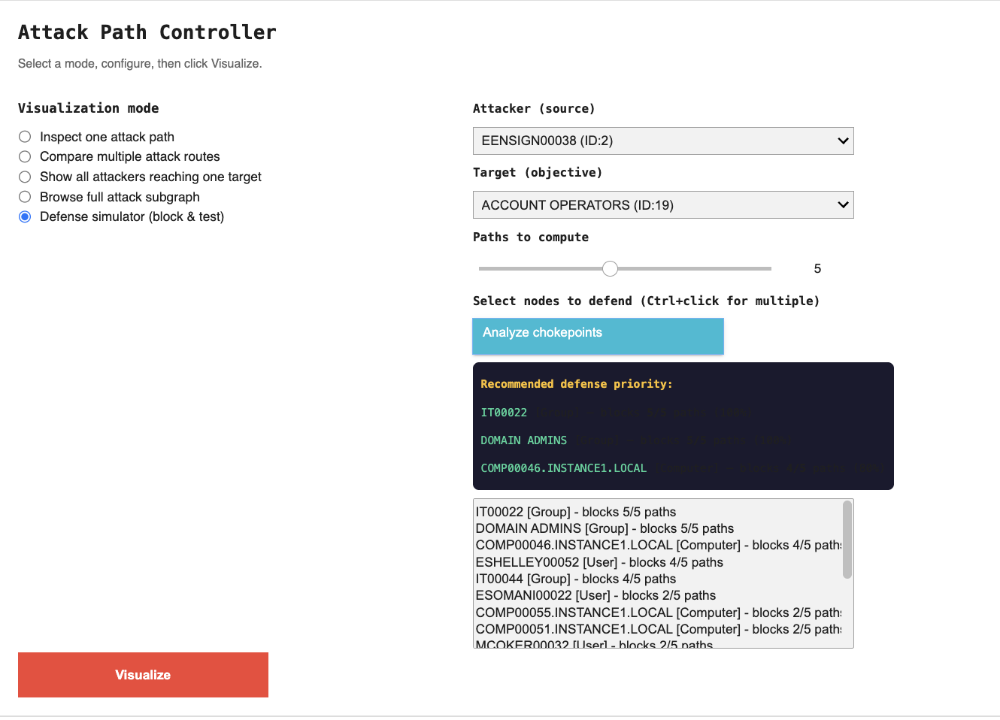
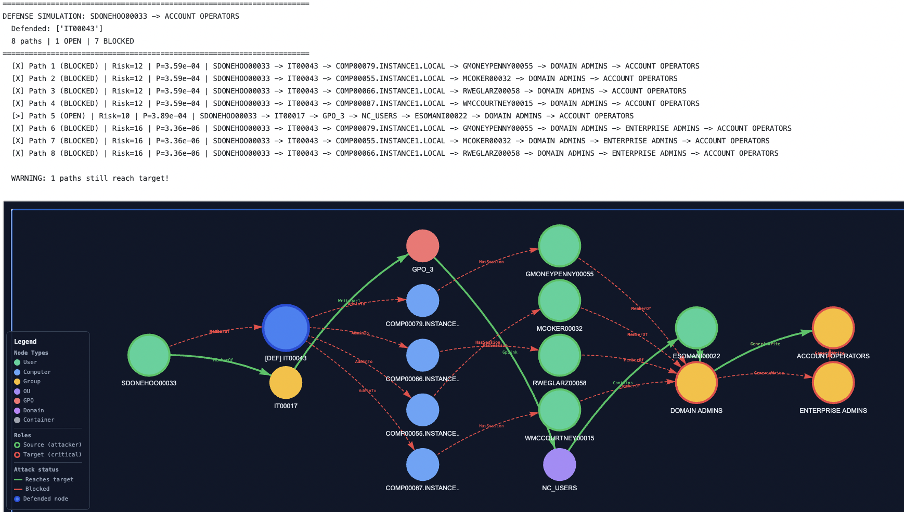

# Using the Interactive Visualization of Graph 1

The notebook above provides an **interactive Attack Path Controller**, allowing you to explore and understand potential attack paths within your simulated Active Directory environment (Graph 1).

## Overview

After loading the structured graph (`Dataset/graph_1_structured.json`), the tool generates an interactive panel (Jupyter Widgets) to facilitate exploration.

This panel allows you to:

- **Select a visualization mode**: Choose how you want to view the graph (single path, multiple paths, etc.).

- **Define parameters**: Specify the source (attacker), the target (objective), and additional options such as the number of paths to compute.

- **Visualize results**: An interactive graph is displayed, where you can interact with nodes and edges.

## Visualization Modes

The controller offers several modes to analyze attack paths:

- **Inspect one attack path** (`Inspect one attack path`)  
  Displays the shortest path between a source and a target.  
  You can select the path index (0 being the shortest).

- **Compare multiple attack routes** (`Compare multiple attack routes`)  
  Highlights multiple paths (up to *k* paths) between a source and a target.  
  This helps identify alternative routes an attacker could take.

- **Show all attackers reaching one target** (`Show all attackers reaching one target`)  
  Visualizes all paths from every source to a specific target.  
  Useful for assessing the vulnerability of a critical asset.

- **Browse full attack subgraph** (`Browse full attack subgraph`)  
  Displays the entire interactive attack subgraph without filtering by source/target.

- **Defense simulator** (`Defense simulator`)  
  A “game-like” mode that lets you test the impact of defending certain nodes on attack paths.

---

## Defense Simulator

The **Defense simulator** mode provides an interactive way to evaluate the effectiveness of your defense strategies.

### How to use it

1. **Select the mode**  
   Choose `"Defense simulator (block & test)"` in the mode selector.

2. **Select source and target**  
   Define where the attacker starts and what the target is.

3. **Analyze chokepoints**  
   Click `"Analyze chokepoints"`.  
   This lists intermediate nodes that would block the most attack paths if defended.  
   It provides defense suggestions to maximize efficiency.

4. **Select nodes to defend**  
   In `"Select nodes to defend"`, choose one or more nodes to secure  
   (e.g., enabling MFA, strengthening monitoring, etc.).  
   Use `Ctrl + click` for multiple selections.

5. **Visualize the impact**  
   Click `"Visualize"`.  
   The graph will display:
   - **BLOCKED paths** (in red, dashed)
   - **OPEN paths** (in green)

   Defended nodes are highlighted.  
   The goal is to block all paths to the target.

---

This allows you to simulate and iterate on different defense strategies to understand their impact on attack paths within your network.

---

# Attack Path Controller

Use the interactive panel below to explore attack paths without editing any code.  
Select a visualization mode, choose your source and target, and click **Visualize**.

## Understanding K Paths and Path Lengths

These two parameters answer different questions:

- **K Paths is a configurable setting**  
  It determines how many alternative routes the algorithm should search for.  
  Setting `K = 8` means *"find up to 8 different paths from source to target"*.  
  It does **not** mean each path has 8 nodes.

- **Length is a result**  
  It describes a specific path.  
  `"Length: 5 nodes"` means the path includes 5 nodes (4 edges/steps).

Each of the K paths can have a different length:
- Path 1 might have 5 nodes  
- Path 2 might have 6 nodes  
- Path 3 might have 7 nodes  

Paths are ranked from shortest to longest.