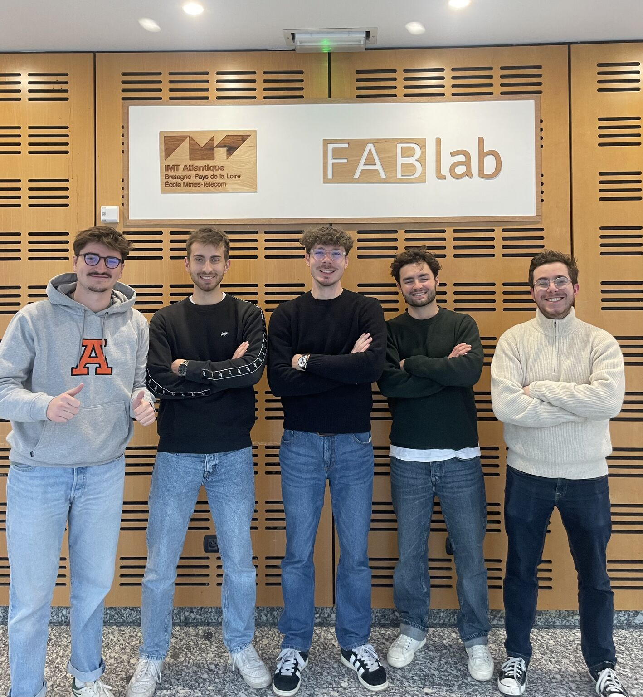

# Active Directory attack simulator

Welcome to the official documentation of the **S6B2 Cyber Project** at IMT Atlantique. Our mission was to transform complex Active Directory (AD) attack path simulations into a visual, interactive, and educational experience.

---

## Project Context

This project was commissioned by **Alexandre REIFFERS-MASSON**, Associate Professor at **IMT Atlantique**. 

Our work was built upon the foundations of the [**Markov_Budget**](https://github.com/Lilianltd/Markov_Budget/) project. The original pipeline focuses on:

* **Automated Generation**: Creating randomized AD environments using `adsimulator`.

* **Mathematical Modeling**: Converting attack graphs into probabilistic transition matrices.

* **Defense Optimization**: Using Monte Carlo simulations and Dirichlet distributions to find optimal budget allocations to minimize risk.

---

## Project Management: Agile Method

To ensure efficiency and continuous delivery, our team operated using the **Agile methodology**. We have defined 3 core **User Stories** that guide our development sprints:

* **US #1: Attack Dataset** : Strengthening and diversifying the generation of attack data to provide a rich base for machine learning.

* **US #2: Interactive Visualization** : Developing the core product: a ludic interface where users can visualize and interact with AD attack paths.

* **US #3: Documentation Portal** : Creating this comprehensive website to popularize our findings and document the project's technical architecture.

---

## The Team

We are 5 students from IMT Atlantique, dedicated to this one month project:

| Name | from this TAF |
| :--- | :--- |
| [**Edouard BOUTOILLE**](https://www.linkedin.com/in/edouard-boutoille/) | TEE |
| [**Julien PICOT**](https://www.linkedin.com/in/julien-picot/) | HEALTH |
| [**Pierre LENOIR**](https://www.linkedin.com/in/pierre-l-07b439183/) | TEE |
| [**Mael HUSSANT**](https://www.linkedin.com/in/mael-hussant/) | CYBER |
| [**Tristan BLANC**](https://www.linkedin.com/in/tbjl/) | HEALTH |

