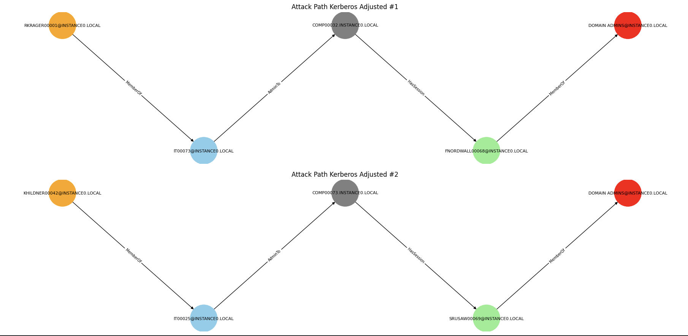

# Kerberos Adjusted Attack Path Analysis

## Definition

The **Kerberos Adjusted attack model** is a simulated graph-based attack scenario used to model constrained privilege escalation paths in an Active Directory environment.

In this project, a Kerberos Adjusted path is defined as:

> A structured attack chain starting from a standard user, passing through at least one SPN-enabled account, and ending at an administrative account, within a fixed-length traversal of the graph.

This abstraction represents a simplified version of Kerberoasting-like behavior, focusing on graph traversal rather than cryptographic ticket cracking.

---

## Theoretical Background

Kerberos is the default authentication protocol used in Active Directory environments to securely authenticate users and services using ticket-based authentication.

It allows users to access services without repeatedly entering credentials, using **Ticket Granting Tickets (TGTs)** and **Service Tickets (TGS)**.

### SPN Accounts

A **Service Principal Name (SPN)** is an identifier assigned to a service instance running on a specific machine in Active Directory.

SPN accounts are critical in attack modeling because they can be abused in **Kerberoasting scenarios**, where:

- A service ticket is requested for an SPN account  
- The ticket is extracted by the attacker  
- The ticket is cracked offline to recover service credentials  

This makes SPN-enabled accounts a key pivot point in privilege escalation chains.

---

## Dataset Specificity

In the simulated environment provided by `graph_0.json`, the Active Directory structure is simplified:

- A limited number of SPN-enabled accounts are present
- The graph is artificially reduced for analysis purposes
- Not all users are service-linked
- Administrative accounts are clearly defined but minimal

This controlled structure enables deterministic analysis of attack paths and ensures reproducibility of results.

---

## Attack Logic in the Simulator

The Kerberos Adjusted attack model follows a structured progression:

1. Initial compromise of a standard user account  
2. Traversal towards SPN-enabled service accounts  
3. Abuse of service ticket mechanisms (abstracted in the simulation)  
4. Final privilege escalation to an administrative account  

Each valid path represents a potential multi-step compromise chain in a real Active Directory environment.

---

## Detection Constraints

A valid Kerberos Adjusted path must satisfy the following conditions:

- The path must start from a **User node**
- The path must contain exactly **4 edges (5 nodes total)**
- At least one node must be an **SPN-enabled account**
- The path must terminate at an **administrative account**

These constraints ensure that only realistic and structured escalation paths are considered.

---

## Summary

The implementation identifies all valid Kerberos Adjusted paths in the graph and highlights:

- Entry points (User nodes)
- SPN pivot nodes
- Final administrative targets
- Valid constrained attack chains

This allows systematic analysis of privilege escalation risks within the simulated Active Directory environment.